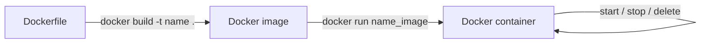
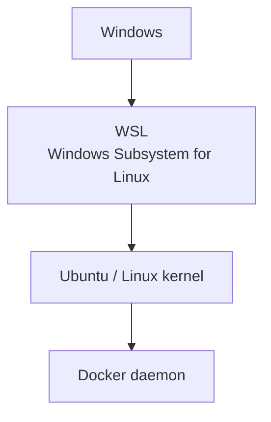

# Điểm cần xem lại: Docker, Linux, WSL

> File review do Claude viết. Các ghi chú gốc **chưa bị sửa**. Mục nào đồng ý sửa thì bảo Claude.

## Sơ đồ luồng Docker



## Sơ đồ WSL



## Danh sách điểm cần xem lại

| # | File | Ghi chú gốc | Đề xuất | Lý do |
|---|------|-------------|---------|-------|
| 1 | docker-basics | `PROM base-image` | `FROM base-image` | `PROM` không phải lệnh Dockerfile |
| 2 | docker-basics | `docker build -t name.` | `docker build -t name .` | Thiếu khoảng trắng trước `.` (build context) |
| 3 | docker-basics | `docker run it name_image bash` | `docker run -it name_image bash` | Thiếu dấu `-` |
| 4 | docker-basics | "Câu lệnh build Docker container" | "Câu lệnh chạy Docker container" | `docker run` tạo và chạy container, không build |
| 5 | linux-ubuntu-wsl | "Wsl giúp Linux giao tiếp Windows" | "WSL giúp Windows chạy được Linux" | Ngược hướng |
| 6 | docker-commands | `docker —version` | `docker --version` | Dấu gạch bị tự động đổi |
| 7 | docker-basics | `EXPOSE ports` | Giữ, nhưng nên ghi chú thêm | Chỉ khai báo cổng, muốn mở ra host phải dùng `-p` |
| 8 | nhiều file | "thiết kể", "Unbutu", `COPY` thiếu tham số | Chính tả / bổ sung | Lỗi gõ |

## Cách chèn hình vào file .md

Đặt ảnh vào thư mục `assets/` rồi dùng đường dẫn tương đối:

```markdown

```

- Đường dẫn tính từ vị trí file `.md` (từ `03-devops/docker/` thì cần `../../assets/`).
- Xem trong VS Code: `Ctrl+Shift+V` để mở preview (Mermaid cần extension *Markdown Preview Mermaid Support*). GitHub hiển thị cả ảnh và Mermaid sẵn.
- Dán ảnh nhanh trong VS Code: copy ảnh rồi `Ctrl+V` vào file `.md`, VS Code (bản mới) tự lưu ảnh và chèn link.
