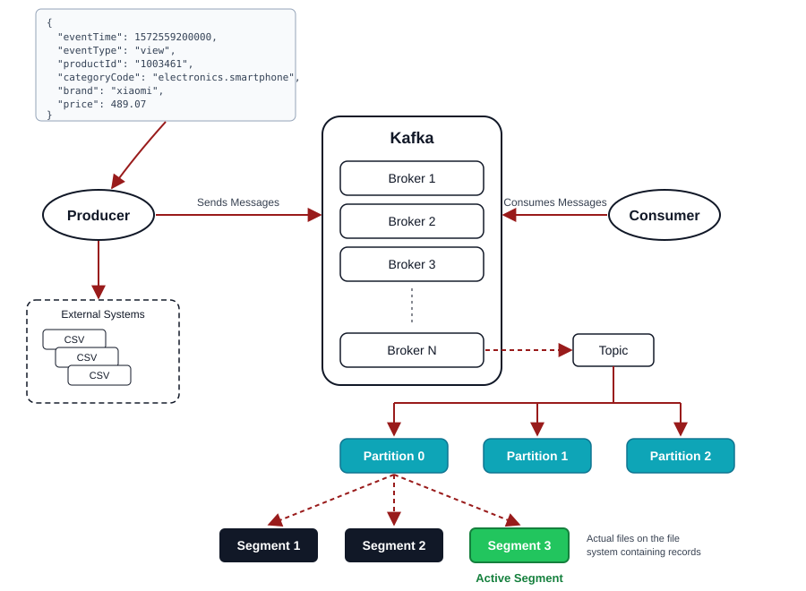

# Apache Kafka:

- Event stream platform, hơn cả là một message broker
- Hệ thống distributed messaging system
- Truyền lượng lớn message theo thời gian thực
- Message được lưu trên disk và replicate trong cluster -> không mất dữ liệu
- Là một nền tảng trung gian giúp các service trao đổi event .Nó nhận và lưu event, rồi phân phối cho bên cần xử lý. Nhờ đó, các service không phụ thuộc trực tiếp vào nhau, hệ thống vẫn dễ mở rộng và chịu lỗi.

## Khái niệm:

- Cluster: tập hợp nhiều broker cùng nhau như một hệ thống để lưu trữ, xử lý dữ liệu; chúng cùng chia tải, sao chép dữ liệu để mở rộng và vẫn chạy khi có lỗi.
- Broker là từng máy chủ riêng, nhận message từ producer và truyền dữ liệu cho consumer
- Topic: một chủ đề message , mỗi message lưu vào Kafka phải thuộc 1 topic cụ thể
- Partition: là cách một topic được chia thành nhiều phần, giúp phân tán dữ liệu, partition cho phép nhiều consumer trong cùng một nhóm đọc song song nhiều partition khác nhau để tăng tốc độ xử lý, dễ mở rộng

## Workflow

Cluster gồm nhiều broker, topic tồn tại trên toàn cluster, trong topic sẽ nhiều cái partition, và nó thì sẽ lưu trữ trên broker khác nhau, và sẽ những partition gọi leader kèm theo đó là có thể có nhiều partition follower thì sẽ lưu ở những broker khác, khi broker nào đó bị lỗi mà chứ partition leader, thì kafka(zookeeper)sẽ có partition follower khác ở broker khác được làm bầu lên leader, đảm nhiệm nhiệm đó leader đó.

Topic là tài nguyên logic nằm trên cluster, broker nào có partition của topic đó thì topic đó mới tồn tại ngược lại thì không

6. Làm sao để biết message đã được ghi vào partition?

Dựa vào acknowledge, có 3 chế độ:
- Ack: 0 (fire and forget), không chờ phản hồi có thể mất message
- Ack:1 (default) chờ leader xác nhận (vẫn có rủi ro nếu leader hỏng).
- Ack: all  chờ leader phản hồi + toàn bộ write thành công -> không mất message

-> chế độ càng đảm bảo message được ghi thì càng bị giảm performance

-Điều kiện ràng buộc: min.insync.replicas(số partition follower tối thiểu được ghi vào mới xác nhận là ghi thành công ) <= replication.factor(tổng partition follower của leader)

Làm sao để producer điều hướng message vào đúng partition để giữ ordering?

Dùng message key

Consumer nhận được message như thế nào?
- Consumer đọc message từ topic(xác định bằng topic name)
- Đọc tuần tự trong partition(offset 1 rồi mới đến 2)
- 1 consumer thì có đọc nhiều partition( tùy vào cách code, sử dụng đa luồng xử lý nhiều partition cùng một cách) nhưng 1 partition consumer trong cùng một group
- Cái message ordering chỉ đảm bảo khi cùng trên một partition.

## Application layer và Transport:

- Emit(Producer), @EventPattern(chỉ cần gửi và không cần nhận phản hồi)(Consumer)
- sent(Producer), @MessagePattern(Gửi và chờ nhận phản hồi)(framework NestJS)(Consumer)

Mấy cách tạo topic trong Kafka?(2 cách) Nếu set auto trong file config thì dòng code nào sẽ quyết định topic được tạo?

Consumer commit offset để làm gì? Để đánh dấu tiến độ đọc consumer trong partition, giúp consumer biết nên đọc tiếp từ đâu khi bị restart, tránh xử lý trùng lặp, tránh xử lý thiếu.

Sự khác nhau giữa auto commit và manual commit?
- Auto commit: consumer tự commit offset theo chu kỳ
- Manual commit: tự gọi commit khi đã sử lý xong
