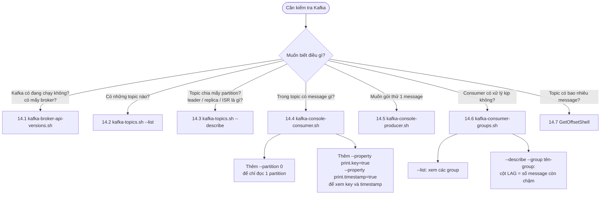
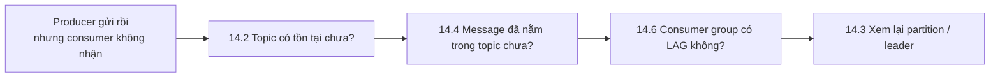

# Câu lệnh để check trang kafka docker:

## Sơ đồ: gặp tình huống nào thì dùng lệnh nào



## Chuỗi debug thường gặp



14.1. Xem danh sách broker / thông tin cluster

```bash
docker compose exec kafka /opt/kafka/bin/kafka-broker-api-versions.sh --bootstrap-server localhost:9092
```
Vì đây là single-node KRaft nên chỉ có 1 broker (node id = 1).

14.2. Danh sách topic

```bash
docker compose exec kafka /opt/kafka/bin/kafka-topics.sh --bootstrap-server localhost:9092 --list
```

14.3. Xem chi tiết 1 topic (partition, replica, leader, ISR)

```bash
docker compose exec kafka /opt/kafka/bin/kafka-topics.sh --bootstrap-server localhost:9092 --describe --topic <ten-topic>
```
Không truyền --topic sẽ describe tất cả topic.
```bash
docker compose exec kafka /opt/kafka/bin/kafka-topics.sh --bootstrap-server localhost:9092 --describe --exclude-internal
```

14.4. Đọc message trong topic

Từ đầu topic:
```bash
docker compose exec kafka /opt/kafka/bin/kafka-console-consumer.sh --bootstrap-server localhost:9092 --topic <ten-topic> --from-beginning
```
Chỉ đọc 1 partition cụ thể:
```bash
docker compose exec kafka /opt/kafka/bin/kafka-console-consumer.sh --bootstrap-server localhost:9092 --topic <ten-topic> --partition 0 --from-beginning
```
Xem cả key + timestamp:
```bash
docker compose exec kafka /opt/kafka/bin/kafka-console-consumer.sh --bootstrap-server localhost:9092 --topic <ten-topic> --from-beginning --property print.key=true --property print.timestamp=true
```
Nhấn Ctrl+C để thoát (nó là lệnh chạy liên tục theo kiểu tail -f).

14.5. Gửi thử message (test producer)

```bash
docker compose exec kafka /opt/kafka/bin/kafka-console-producer.sh --bootstrap-server localhost:9092 --topic <ten-topic>
```
Gõ nội dung rồi Enter để gửi, Ctrl+C để thoát.

14.6. Xem consumer group & lag (rất hữu ích để debug backend/mail-service/inventory-service có đang consume kịp không)

```bash
docker compose exec kafka /opt/kafka/bin/kafka-consumer-groups.sh --bootstrap-server localhost:9092 --list
docker compose exec kafka /opt/kafka/bin/kafka-consumer-groups.sh --bootstrap-server localhost:9092 --describe --group <group-id>
```
Cột LAG cho biết consumer đang chậm bao nhiêu message.

14.7. Đếm số message trong topic

```bash
docker compose exec kafka /opt/kafka/bin/kafka-run-class.sh kafka.tools.GetOffsetShell --broker-list localhost:9092 --topic <ten-topic>
```
Kết quả trả về offset cuối mỗi partition (partition:offset:count-ish, cần cộng dồn theo partition).
