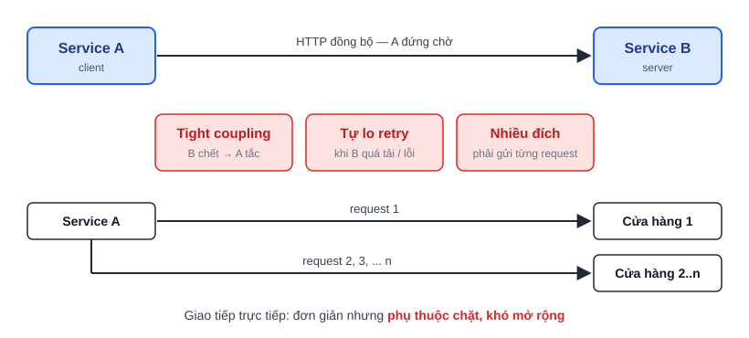

# Message broker và message-driven programming

1.1. Trong microservice thường sẽ có 2 cách giao tiếp giữa các service với nhau:
- Messaging(ý tưởng, khái niệm non_blocking): dùng một nền tảng trung để giúp 2 service giao tiếp với nhau, không bị block, không mất event khi service sập
- Rest API hay gRPC: giao tiếp trực tiếp thông qua HTTP(gửi request và sẽ nhận được response)

1.2. Message-driven programming(cách mình lập trình):
Các service không giao tiếp trực tiếp, không biết địa chỉ, và chỉ cần gửi địa chỉ, bên thứ 3 điều hướng Messenger với đúng địa chỉ, đúng nội dung

1.3. Message broker:
Là các nền tảng xây dựng trên ý messaging như Kafka. RabbitMQ,...
- Giảm tải server-bớt tương tác trực tiếp
- Lưu trữ request khi server gặp sự cố
- Phân phối request
- Đơn giản hóa việc gửi nhận trong môi trường multi-service

Có hai pattern phân phối message

2.1. Point-to-point: quan hệ 1-1, mỗi message gửi đúng một endpoint duy nhất(chat giữa 2 người)

2.2. Broadcast(Topic): 1 message đến nhiều subscribers

Phân loại broker:

3.1. Message base: đảm bảo mỗi consumer nhận message đúng một lần

3.2. Data pipeline: ưu tiên độ chính xác, không mất message(Kafka thuộc nhóm này)
