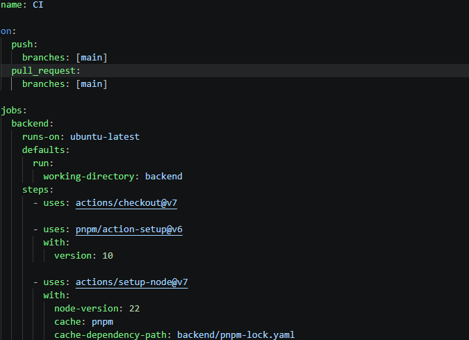

# CI/CD

Khái niệm: hiểu đơn giản là tự động kiểm tra và đưa code mình lên server

CI(Continuous Integration): mỗi lần push code lên github, github tự động:
- Lấy code xuống
- Cài đặt dependencies
- Chạy test/lint nếu có
- pnpm run build
- Báo cáo xanh nếu ổn, đỏ nếu lỗi

CD(Continuous deployment/delivery): CI ổn thì tự động deploy code lên server

-> GitHub Actions chính là công cụ giúp mình làm CI/CD trên GitHub.

ci.yml : là file cấu hình những việc github Actions cần làm (file phải nằm trong thư mục `.github/workflows/` thì GitHub mới chạy)

- “on”  là khi nào cần chạy
- “jobs” là những công việc cần làm là gì?
- “runs-on” chạy trên máy nào (ví dụ `ubuntu-latest`, `windows-latest`, `macos-latest`)
- “steps” từng bước thực hiện
- “uses”  sử dụng action có sẵn
- “run”  chạy command của mình
