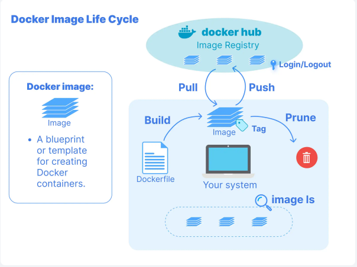
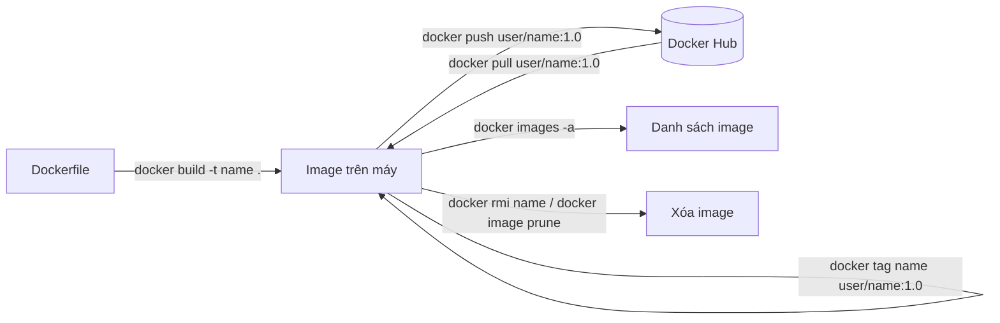
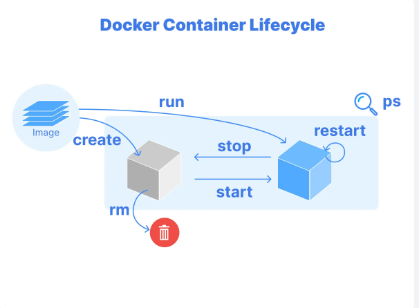
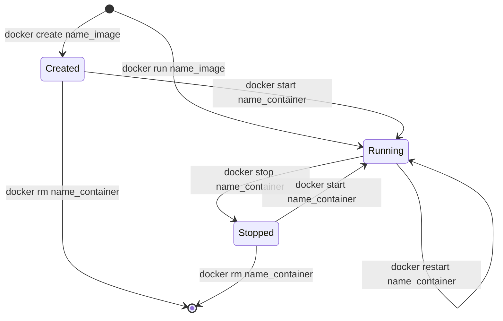

# Docker là gì?
Docker là nền tảng mã nguồn mở giúp đóng gói ứng dụng và các thành phần phụ thuộc vào các container, cho phép triển khai và chạy ứng dụng một cách nhất quán trên nhiều môi trường khác nhau.

## Thành phần của Docker:

docker file: như một thiết kế để xây dựng  build ra docker image

```dockerfile
# Bắt đầu với nền móng
FROM base-image
# Xây dựng khung nhà
RUN apt-get update && apt-get install -y dependencies
# Chỉ định vị trí xây dựng
WORKDIR /project
# Lắp ráp tường và mái nhà
COPY
# Cài đặt hệ thống nước và điện
RUN setup-scripts
# Sơn và hoàn thiện
EXPOSE ports
# Chuyển vào nhà
CMD ["run", "application"]
```

> Lưu ý: `EXPOSE` chỉ khai báo cổng mà container dùng, không mở cổng ra máy host. Muốn truy cập từ máy host thì dùng `-p` khi `docker run`.

Docker image là template để build Docker container. Nó bao gồm thành phần, bộ phận, thư viện… được chỉ định trong Docker image, sẵn sàng được triển khai ở nhiều nơi khác nhau. -> build từ Dockerfile



Vòng đời image kèm câu lệnh:



Docker container: là một phiên bản đang chạy của Docker image(là các instance chạy từ image, có thể start, stop, move, delete)



Vòng đời container kèm câu lệnh:



Xem container đang chạy: `docker ps` (thêm `-a` để xem cả container đã dừng).

Câu lệnh build Docker image:
```bash
docker build -t name .
```

Câu lệnh chạy Docker container:
```bash
docker run name_image  or docker run -it name_image bash (giúp chui vào bên trong để thêm câu lệnh)
```

Để cài đặt những gói, những phần mềm trong Ubuntu thì dùng:
apt-get (dùng apt-get update trước)
