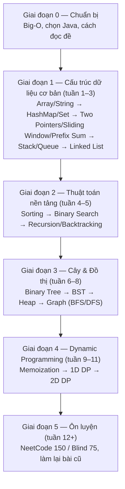

# Cấu trúc dữ liệu & Giải thuật — Data Structures & Algorithms

Linked List, Tree, Graph, Recursion, Dynamic Programming...

Hồi sinh viên:

> “Ra trường em làm web chứ có đi đảo Binary Tree đâu.”

Đến lúc phỏng vấn:

> “Em reverse linked list giúp anh nhé.”

🙂

Khó ở chỗ đây không chỉ là học thuộc thuật toán, mà là học cách tư duy và giải quyết vấn đề. Với Fresher/Junior, DSA vẫn rất hữu ích, đặc biệt khi phỏng vấn vào các công ty có vòng technical bài bản.

---

## Roadmap học DSA (Java)

Khoảng 10–12 tuần, 1–2 giờ/ngày. Ngôn ngữ: **Java**.

### Sơ đồ tổng quan

### Giai đoạn 0 — Chuẩn bị (3–4 ngày)

- Chọn **một** ngôn ngữ để làm bài: Java.
- Học **Big-O** (time/space complexity), nền tảng cho mọi thứ phía sau.
- Biết đọc đề, tìm ví dụ nhỏ, nói được hướng giải trước khi code.

### Giai đoạn 1 — Cấu trúc dữ liệu cơ bản (tuần 1–3)

1. Array và String
2. Hash Map / Set (công cụ dùng nhiều nhất khi phỏng vấn)
3. Two Pointers, Sliding Window, Prefix Sum
4. Stack và Queue
5. Linked List: reverse, tìm cycle, merge hai list đã sort

### Giai đoạn 2 — Thuật toán nền tảng (tuần 4–5)

1. Sorting: hiểu Bubble, Merge, Quick sort, rồi dùng hàm sort có sẵn
2. Binary Search, gồm cả "binary search trên đáp án"
3. Recursion và Backtracking: subsets, permutations

### Giai đoạn 3 — Cây và đồ thị (tuần 6–8)

1. Binary Tree: DFS, BFS, duyệt inorder/preorder/postorder
2. Binary Search Tree
3. Heap / Priority Queue
4. Graph: adjacency list, BFS, DFS, đếm số island
5. Tuỳ chọn: Trie, Union-Find, Topological Sort

### Giai đoạn 4 — Dynamic Programming (tuần 9–11)

- Bắt đầu bằng Fibonacci, Climbing Stairs (memoization).
- Tiếp theo: 1D DP (House Robber, Coin Change), rồi 2D DP (Unique Paths, LCS).
- Làm ít bài nhưng phải hiểu kỹ, đây là phần khó nhất.

### Giai đoạn 5 — Ôn luyện (tuần 12 trở đi)

- Làm các bộ bài có sẵn như **NeetCode 150** hoặc **Blind 75**, theo từng pattern.
- Mỗi tuần làm lại vài bài cũ để không quên.

### Cách học

- **Học pattern, đừng học thuộc bài.** Mỗi chủ đề làm khoảng 5–8 bài từ dễ đến vừa rồi mới qua chủ đề khác.
- Bí quá 20–30 phút thì xem lời giải, sau đó tự code lại không nhìn, hôm sau làm lại một lần nữa.
- Tập vừa code vừa nói to cách nghĩ, vì phỏng vấn đòi hỏi điều này.
- Công cụ: NeetCode (video, roadmap), LeetCode (thực hành), visualgo.net (xem thuật toán chạy).

### Java cần nắm cho DSA

| Cần | Dùng |
|---|---|
| Mảng động | `ArrayList<Integer>` |
| Hash Map / Set | `HashMap`, `HashSet` (`getOrDefault`, `merge`, `computeIfAbsent`) |
| Stack | `ArrayDeque` (thay cho `Stack` là class cũ và chậm) |
| Queue / Deque | `ArrayDeque` hoặc `LinkedList` |
| Heap | `PriorityQueue` (mặc định min-heap; max-heap dùng `Collections.reverseOrder()` hoặc comparator) |
| Map có thứ tự key | `TreeMap`, `TreeSet` |

Những chỗ dễ vấp:

- So sánh `Integer` bằng `.equals()`, đừng dùng `==` (giá trị ngoài -128..127 sẽ sai).
- `String` là immutable; nối chuỗi trong vòng lặp thì dùng `StringBuilder`.
- Tràn số `int`: viết `left + (right - left) / 2` thay vì `(left + right) / 2`, dùng `long` khi cộng/nhân số lớn.
- `Arrays.sort(arr, comparator)` chỉ dùng được với mảng object, không dùng với `int[]`.
- Mảng dùng `.length`, `String` dùng `.length()`, collection dùng `.size()`.
- Tự định nghĩa node: `class ListNode { int val; ListNode next; }`, `class TreeNode { int val; TreeNode left, right; }`.

### Tuần đầu tiên

1. Học Big-O.
2. Ôn `array`, `String`, `StringBuilder`, `ArrayList`, `HashMap`, `HashSet`.
3. Làm 5 bài LeetCode: Two Sum, Valid Anagram, Contains Duplicate, Best Time to Buy and Sell Stock, Valid Palindrome.

### Tiến độ

- [ ] Giai đoạn 0 — Chuẩn bị
- [ ] Giai đoạn 1 — Cấu trúc dữ liệu cơ bản
- [ ] Giai đoạn 2 — Thuật toán nền tảng
- [ ] Giai đoạn 3 — Cây & Đồ thị
- [ ] Giai đoạn 4 — Dynamic Programming
- [ ] Giai đoạn 5 — Ôn luyện
